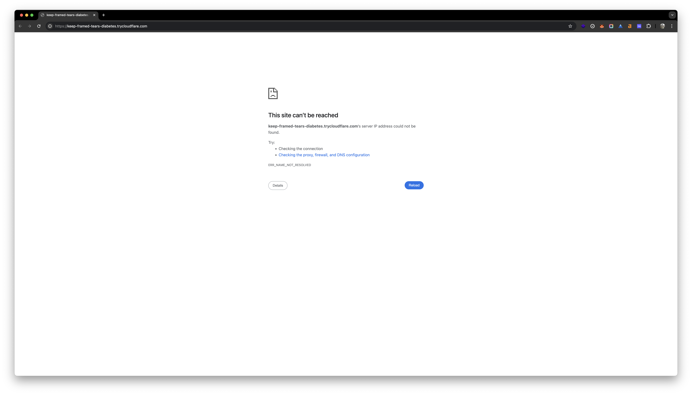

# Cleanup DNS Cache

Sometimes we just spawned a new domain, but the DNS cache is still pointing to the old one.

```text
2025/05/25 12:54:49 INFO starting shell-now
2025/05/25 12:54:49 INFO waiting for a domain to be assigned...
2025/05/25 12:54:53 INFO shell-now is ready to use
2025/05/25 12:54:53 INFO --------------------------------
2025/05/25 12:54:53 INFO USERNAME: shell-now
2025/05/25 12:54:53 INFO PASSWORD: 830170
2025/05/25 12:54:53 INFO DOMAIN: https://keep-framed-tears-diabetes.trycloudflare.com
2025/05/25 12:54:53 INFO --------------------------------
2025/05/25 12:54:53 INFO use CTRL+C to stop the service
```



## Flush DNS Cache

macOS

```bash
sudo dscacheutil -flushcache; sudo killall -HUP mDNSResponder
```

windows

```bash
ipconfig /flushdns
```

linux with systemd-resolved

```bash
sudo systemd-resolve --flush-caches
```

## Flush Chrome DNS Cache

open `chrome://net-internals/#dns` and click on `Clear host cache`
