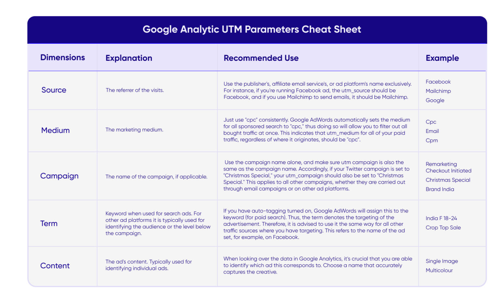

# UTM

## Overview

UTM means Urchin Tracking Module, which introduced by 'Urchin Software Corporation', then get acquired by Google in April 2005, became Google Analytics.

We could use UTM tags(sometime called UTM parameters) to track the source of traffic to our website. It's a way to track the effectiveness of our marketing campaigns.

For example, we're going to add a new button inside our [Bridge](https://boringboring.design/products/bridge) app.

We're going use these swift codes to open the browser:

```swift
NSWorkspace.shared.open(URL(string: "https://boringboring.design/products/bridge")!)
```

But we will never know how many people clicked on the button. Google Analytics will show it as `Direct` traffic.

So we could add UTM tags to the URL:

```swift
NSWorkspace.shared.open(URL(string: "https://boringboring.design/products/bridge?utm_source=bridge_app&utm_medium=button&utm_campaign=bridge_app_button")!)
```

Then we could track the traffic in Google Analytics.

## Cheat Sheet

- `utm_source`: The referrer of the traffic, like `google`, `facebook`, `twitter`, etc.
- `utm_medium`: The medium of the traffic, like `cpc`, `banner`, `email`, etc.
- `utm_campaign`: The name of the campaign, like `spring_sale`, `summer_sale`, etc.
- `utm_term`: The keyword of the campaign, like `apple`, `iphone`, etc.
- `utm_content`: The content of the campaign, like `logo`, `text`, etc.


